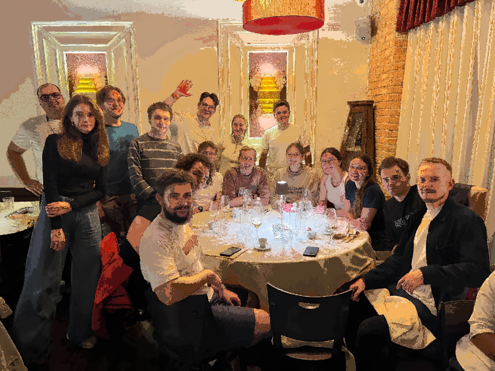

*"Retrieval-Augmented Super Resolution through Mosaic Synthesis of Memory-Enhanced Image Patches"*

**Description**: 

This project was crafted for fun as part of an exploration into AI techniques for AI News. The primary code and progress tracking can be found in `sr-mosaic.ipynb`.

The goal of this project is to create a mosaic-based image super resolution generator that overcomes common issues of detail loss, often seen in traditional mosaicking methods due to pixel averaging or nearest-neighbor extrapolation. In my approach, I address these challenges by first partitioning the image dataset into 8x8 patches, scaling each image down by 32x to ensure each patch contains distinct, meaningful information (such as facial features). 

From these patches, I extract embeddings to quickly retrieve contextually appropriate patches through vector search. To achieve high-quality resolution, I apply a 4x upscaling using the HAT model, which is specifically trained for RealSR tasks to handle noise effectively. This approach provides a unique twist on Retrieval-Augmented Generation (RAG), using stored image "memory" to generate a coherent, high-resolution mosaic that extends beyond traditional super resolution techniques.

--- 

Let me know if there’s any more you’d like to add or adjust!

  

