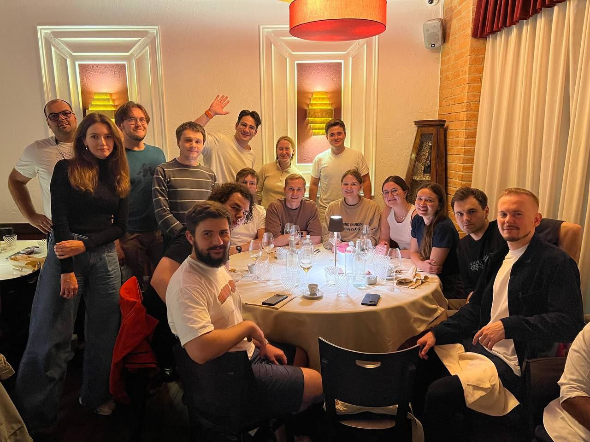
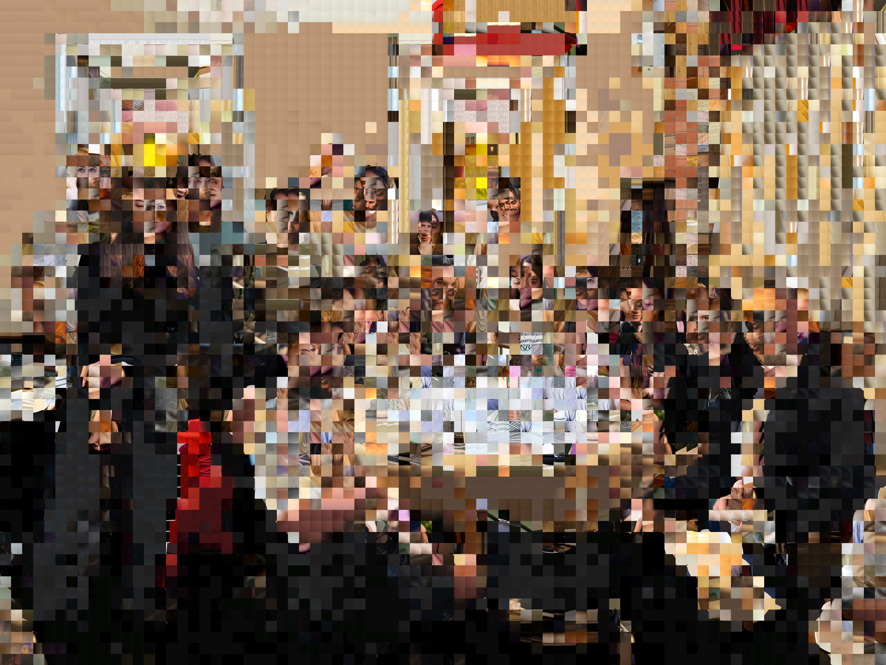

# **Memory-Augmented Super Resolution via Patch-Based Mosaic Synthesis with Vector Search**

**Description**: 

This project was crafted for fun and for [AI News](t.me/ai_newz). The main code, including progress tracking, is available in `sr-mosaic.ipynb`.

This project explores an unconventional approach to Super Resolution by combining mosaic generation with Retrieval-Augmented Generation (RAG) techniques. Traditional mosaicking often results in detail loss due to pixel averaging or simple nearest-neighbor extrapolation. My approach mitigates this by using vector search for patch retrieval, dynamically constructing high-resolution images based on stored "memory" of image patches.

The process begins with partitioning the image dataset into 8x8 patches, while downscaling images by a factor of 32x to ensure that each patch captures distinct, meaningful information (e.g., facial features). I then extract embeddings from each patch to enable efficient vector-based retrieval of the most contextually appropriate patches. 

To further enhance resolution, a 4x upscaling is applied using the HAT model, optimized for RealSR tasks to handle noise and maintain fidelity. The result is a high-quality, memory-enhanced mosaic that merges Super Resolution with RAG-like memory retrieval, producing a novel SR technique that selects patches intelligently instead of merely relying on pixel-level interpolation.

**Dataset**: The DF2K dataset (3450 images) serves as the foundation. With a larger dataset and smaller patch size, the model's results could be improved significantly.

In essence, this project combines Super Resolution with a unique RAG-inspired approach, achieving 4x SR through patch replacement based on embedding similarities, found via vector search.

# Original:

  

# SR-mosaic 8 pixels per patch

  

# SR-mosaic 64 pixels per patch

  

